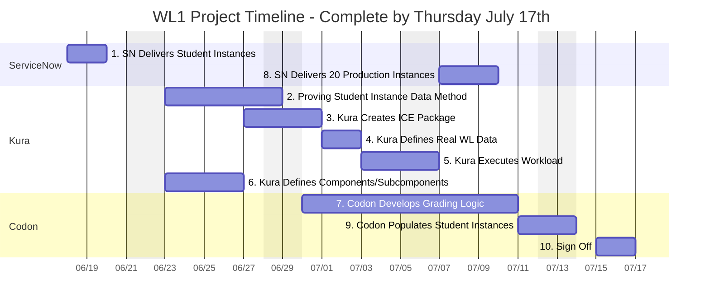

# WL1 Project Schedule

## Project Timeline

## Project Schedule Table

| Task | Owner Org | Owner | Start Date | End Date | Duration | Status | Dependencies |
|------|-----------|-------|------------|----------|----------|--------|--------------|
| 1. SN Delivers Student Instances | ServiceNow | | Wed Jun 18 | Fri Jun 20 | 3 days | ✅ Complete | None |
| 2. Proving Student Instance Data Method | Kura | Luis | Mon Jun 23 | Sun Jun 29 | 5 days | ✅ Complete | Task 1 |
| 3. Kura Creates ICE Package - UNNECESSARY | Kura | Luis, Kevin | Fri Jun 27 | Tue Jul 1 | 3 days | N/A | Task 2 |
| 4. Kura Defines Real WL Data | Kura | Luis | Tue Jul 1 | Thu Jul 3 | 3 days | ✅ Complete | Task 3 |
| 5. Kura Executes Workload | Kura | Luis | Thu Jul 3 | Mon Jul 7 | 3 days | ✅ Complete | Task 4 |
| 6. Kura Defines Components/Subcomponents | Kura | Kevin, Luis | Mon Jun 23 | Fri Jun 27 | 5 days | ✅ Complete | None |
| 7. Codon Develops Grading Logic | Codon | Xavier | Mon Jun 30 | Fri Jul 11 | 9 days | 🔄 Ongoing | Task 6 |
| 8. SN Delivers 20 Production Student Instances | ServiceNow | | Mon Jul 7 | Thu Jul 10 | 4 days | ⏳ Pending | Task 5 |
| 9. Codon Populates Student Instances | Codon | Xavier | Fri Jul 11 | Mon Jul 14 | 3 days | ⏳ Pending | Tasks 7, 8 |
| 10. Sign Off | Codon | Luis, Xavier | Tue Jul 15 | Thu Jul 17 | 3 days | ⏳ Pending | Task 9 |

## Detailed Task Breakdown

### Task 1: SN Delivers Student Instances
| Subtask | Description | Owner Org | Owner | Status |
|---------|-------------|-----------|-------|--------|
| 1a | ServiceNow provisions base student instances | ServiceNow |  | ✅ Complete |
| 1b | Delivery confirmation to project team | ServiceNow | | ✅ Complete |

### Task 2: Proving Student Instance Data Method
| Subtask | Description | Owner Org | Owner | Status |
|---------|-------------|-----------|-------|--------|
| 2a | Kevin creates Workload Prep Instruction | Kura | Kevin | ✅ Complete |
| 2c | Luis configures student instance to workload ready state to create data and artifacts for Codon | Kura | Luis | ✅ Complete |
| 2d | URL for Student Workload Configuration Instance | Kura | Luis | ✅ Complete |
| 2e | Basic auth for Student Workload Instance | Kura | Luis | ✅ Complete |
| 2f | XML Update Set from WL Instance | Kura | Luis | ✅ Complete |
| 2g | URL for Target Student Workload Configuration Instance | Kura | Luis | ✅ Complete |
| 2h | Basic auth for Student Workload Instance | Kura | Luis | ✅ Complete |
| 2i | Codon attempts programmatic replication | Codon | Xavier | ✅ Complete |

### Task 3: Kura Creates ICE Package
| Subtask | Description | Owner Org | Owner | Status |
|---------|-------------|-----------|-------|--------|
| 3a | IF GO: Create structure-only ICE Package | Kura | Luis, Kevin | N/A |
| 3b | IF NO-GO: Create traditional ICE with embedded data | Kura | Luis, Kevin | N/A |
| 3c | Delivery to ServiceNow team | Kura | Nicole | N/A |

### Task 4: Kura Defines Real WL Data
| Subtask | Description | Owner Org | Owner | Status |
|---------|-------------|-----------|-------|--------|
| 4a | Define actual workload data requirements | Kura | Luis | ✅ Complete |
| 4b | Create faulty scenario specifications | Kura | Luis | ✅ Complete |
| 4c | Document data specifications for population | Kura | Luis | ✅ Complete |

### Task 5: Kura Executes Workload
| Subtask | Description | Owner Org | Owner | Status |
|---------|-------------|-----------|-------|--------|
| 5a | Execute workload fix procedures | Kura | Luis | ✅ Complete |
| 5b | Document expected outcomes | Kura | Luis | ✅ Complete |

### Task 6: Kura Defines Components/Subcomponents
| Subtask | Description | Owner Org | Owner | Status |
|---------|-------------|-----------|-------|--------|
| 6a | Define WL1 grading components | Kura | Kevin, Luis | ✅ Complete |
| 6b | Deliver specifications to Codon | Kura | Luis | ✅ Complete |

### Task 7: Codon Develops Grading Logic
| Subtask | Description | Owner Org | Owner | Status |
|---------|-------------|-----------|-------|--------|
| 7a | Develop grading logic based on components | Codon | Xavier | 🔄 Ongoing |
| 7b | Build validation for each subcomponent | Codon | Xavier | ⏳ Pending |
| 7c | Test grading logic | Codon | Luis | ⏳ Pending |

### Task 8: SN Delivers 20 Production Student Instances
| Subtask | Description | Owner Org | Owner | Status |
|---------|-------------|-----------|-------|--------|
| 8a | Install ICE Package on 20 instances | ServiceNow |  | ⏳ Pending |

### Task 9: Codon Populates Student Instances
| Subtask | Description | Owner Org | Owner | Status |
|---------|-------------|-----------|-------|--------|
| 9a | Use approved data population method | Codon, Students | ? | ⏳ Pending |
| 9b | Populate all 20 instances with workload data | Codon | Xavier | ⏳ Pending |
| 9c | Validate data consistency across instances | Kura | Luis | ⏳ Pending |

### Task 10: Sign Off
| Subtask | Description | Owner Org | Owner | Status |
|---------|-------------|-----------|-------|--------|
| 10a | End-to-end testing on populated instances | Codon, Kura | Luis, Xavier | ⏳ Pending |
| 10b | Final validation and sign-off | Kura | Luis | ⏳ Pending |

---
*Last Updated: July 8, 2025*
