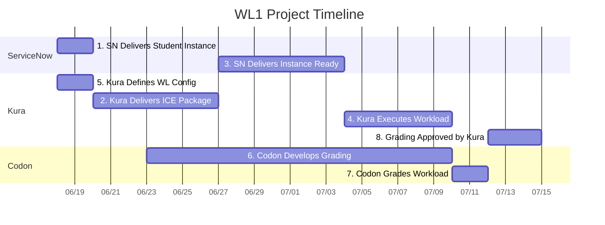

# WL1 Project Schedule - Codon Complete by July 15th

## Project Timeline

## Project Schedule Table

| Task | Owner | Start Date | End Date | Duration | Status | Dependencies |
|------|-------|------------|----------|----------|--------|--------------|
| 1. SN Delivers Student Instance | ServiceNow | Wed Jun 18 | Fri Jun 20 | 3 days | ✅ Complete | None |
| 2. Kura Delivers ICE Package to SN | Kura | Fri Jun 20 | Fri Jun 27 | 7 days | 🔄 In Progress | Task 1 |
| 3. SN Delivers Student Instance Ready | ServiceNow | Fri Jun 27 | Fri Jul 4 | 7 days | ⏳ Pending | Task 2 |
| 4. Kura Executes Workload | Kura | Fri Jul 4 | Thu Jul 10 | 6 days | ⏳ Pending | Task 3 |
| 5. Kura Defines WL Config | Kura | Wed Jun 18 | Fri Jun 20 | 3 days | ✅ Complete | None |
| 6. Codon Develops Grading Capability | Codon | Mon Jun 23 | Thu Jul 10 | 18 days | ⏳ Pending | Tasks 4, 5 |
| 7. Codon Grades Workload | Codon | Thu Jul 10 | Sat Jul 12 | 2 days | ⏳ Pending | Task 6 |
| 8. Grading Approved by Kura | Kura | Sat Jul 12 | Tue Jul 15 | 3 days | ⏳ Pending | Task 7 |

## Detailed Task Breakdown

### Task 1: SN Delivers Student Instance (EOD Jun 20)
| Subtask | Description | Owner | Status |
|---------|-------------|-------|--------|
| 1a | ServiceNow provisions base student instance | ServiceNow | ✅ Complete |
| 1b | Basic instance configuration and setup | ServiceNow | ✅ Complete |
| 1c | Delivery confirmation to project team | ServiceNow | ✅ Complete |

### Task 2: Kura Delivers ICE Package to SN
| Subtask | Description | Owner | Status |
|---------|-------------|-------|--------|
| 2a | Prepare ICE Package including Update Set/Data | Kura | 🔄 In Progress |
| 2b | Package validation and testing | Kura | ⏳ Pending |
| 2c | Delivery to ServiceNow team | Kura | ⏳ Pending |
| 2d | Installation instructions and documentation | Kura | ⏳ Pending |

### Task 3: SN Delivers Student Instance Ready for Workload Execution
| Subtask | Description | Owner | Status |
|---------|-------------|-------|--------|
| 3a | Install ICE Package on student instance | ServiceNow | ⏳ Pending |
| 3b | Configure instance for workload execution | ServiceNow | ⏳ Pending |
| 3c | Create Update Set | ServiceNow | ⏳ Pending |
| 3d | Create Workflow with SLA breach, incident row, faulty notification | ServiceNow | ⏳ Pending |
| 3e | Instance validation and testing | ServiceNow | ⏳ Pending |

### Task 4: Kura Executes Workload
| Subtask | Description | Owner | Status |
|---------|-------------|-------|--------|
| 4a | Fix notification step in workflow | Kura | ⏳ Pending |
| 4b | New notification in workflow | Kura | ⏳ Pending |
| 4c | New incident in incidents table | Kura | ⏳ Pending |
| 4d | Validate workload completion | Kura | ⏳ Pending |

### Task 5: Kura Defines WL Config (EOD Jun 20)
| Subtask | Description | Owner | Status |
|---------|-------------|-------|--------|
| 5a | WL Configuration delivered EOD June 20th | Kura | ✅ Complete |
| 5b | Define WL1 Components: WIP, Notification, Workflow, Scripting | Kura | ✅ Complete |

### Task 6: Codon Develops Grading Capability
| Subtask | Description | Owner | Status |
|---------|-------------|-------|--------|
| 6a | Development starts June 23rd | Codon | ⏳ Pending |
| 6b | Develop query logic via Records API | Codon | ⏳ Pending |
| 6c | Build count validation and incident-notification relationship checks | Codon | ⏳ Pending |
| 6d | TBD: Additional grading requirements | Codon | ⏳ Pending |

### Task 7: Codon Grades Workload
| Subtask | Description | Owner | Status |
|---------|-------------|-------|--------|
| 7a | Execute grading against student instance | Codon | ⏳ Pending |
| 7b | Generate grading results | Codon | ⏳ Pending |
| 7c | Validate grading accuracy | Codon | ⏳ Pending |

### Task 8: Grading Approved by Kura
| Subtask | Description | Owner | Status |
|---------|-------------|-------|--------|
| 8a | Kura validates grading logic and results | Kura | ⏳ Pending |
| 8b | Final approval for WL1 launch | Kura | ⏳ Pending |
| 8c | Sign-off for production deployment | Kura | ⏳ Pending |

---
*Last Updated: June 18, 2025*
