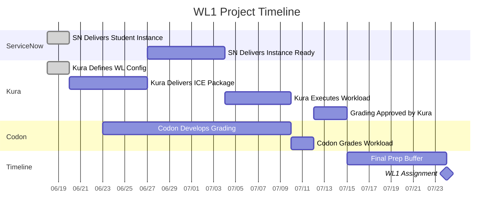

# WL1 Project Schedule - Codon Complete by July 15th

## Project Timeline

## Key Information

**Today:** June 18, 2025 (Wednesday)

**Critical Dates:**
- June 20 (Fri): SN Instance + Kura Config complete
- June 27 (Fri): Kura ICE Package delivered  
- July 4 (Fri): SN Instance ready for workload
- July 10 (Thu): Kura workload execution + Codon development complete
- July 15 (Tue): **CODON COMPLETE** 
- July 24 (Thu): **WL1 ASSIGNMENT**

**Dependencies:**
- Kura ICE Package → SN Instance Ready → Kura Workload → Codon Grading → Kura Approval
- Codon Development runs parallel (starts June 23)
- 9-day buffer for final preparation

---
*Copy this entire content into your GitHub README.md file*
