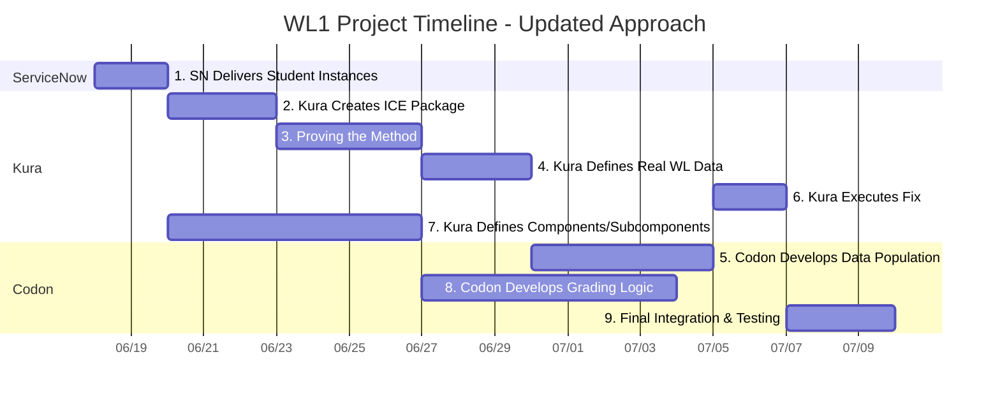

# WL1 Project Schedule - Updated Flow

## Project Timeline

## Project Schedule Table

| Task | Owner Org | Owner | Start Date | End Date | Duration | Status | Dependencies |
|------|-----------|-------|------------|----------|----------|--------|--------------|
| 1. SN Delivers Student Instances | ServiceNow | [Name] | Wed Jun 18 | Fri Jun 20 | 3 days | ✅ Complete | None |
| 2. Kura Creates ICE Package | Kura | [Name] | Mon Jun 23 | Wed Jun 25 | 3 days | ⏳ Pending | Task 1 |
| 3. Proving the Method | Kura | Luis | Thu Jun 26 | Tue Jul 1 | 4 days | ⏳ Pending | Task 2 |
| 4. Kura Defines Real WL Data | Kura | Luis | Wed Jul 2 | Fri Jul 4 | 3 days | ⏳ Pending | Task 3 |
| 5. Codon Develops Data Population | Codon | [Name] | Mon Jul 7 | Fri Jul 11 | 5 days | ⏳ Pending | Task 4 |
| 6. Kura Executes Fix | Kura | [Name] | Mon Jul 14 | Tue Jul 15 | 2 days | ⏳ Pending | Task 5 |
| 7. Kura Defines Components/Subcomponents | Kura | [Name] | Fri Jun 20 | Fri Jun 27 | 7 days | ⏳ Pending | None |
| 8. Codon Develops Grading Logic | Codon | [Name] | Mon Jun 30 | Tue Jul 8 | 7 days | ⏳ Pending | Task 7 |
| 9. Final Integration & Testing | Codon | [Name] | Wed Jul 16 | Fri Jul 18 | 3 days | ⏳ Pending | Tasks 6, 8 |

## Detailed Task Breakdown

### Task 1: SN Delivers Student Instances
| Subtask | Description | Owner Org | Owner | Status |
|---------|-------------|-----------|-------|--------|
| 1a | ServiceNow provisions base student instances | ServiceNow | [Name] | ✅ Complete |
| 1b | Basic instance configuration and setup | ServiceNow | [Name] | ✅ Complete |
| 1c | Delivery confirmation to project team | ServiceNow | [Name] | ✅ Complete |

### Task 2: Kura Creates ICE Package
| Subtask | Description | Owner Org | Owner | Status |
|---------|-------------|-----------|-------|--------|
| 2a | Design ICE Package structure (workflow only) | Kura | [Name] | ⏳ Pending |
| 2b | Create package without data dependencies | Kura | [Name] | ⏳ Pending |
| 2c | Package validation and testing | Kura | [Name] | ⏳ Pending |
| 2d | Delivery to ServiceNow team | Kura | [Name] | ⏳ Pending |

### Task 3: Proving the Method
| Subtask | Description | Owner Org | Owner | Status |
|---------|-------------|-----------|-------|--------|
| 3a | Luis manually creates faulty flow with test data | Kura | Luis | ⏳ Pending |
| 3b | Document exactly what was created manually | Kura | Luis | ⏳ Pending |
| 3c | Communicate requirements to Codon | Kura | Luis | ⏳ Pending |
| 3d | Codon attempts programmatic replication | Codon | [Name] | ⏳ Pending |
| 3e | Validate method success/failure | Kura | Luis | ⏳ Pending |
| 3f | Go/No-Go decision for production approach | Kura | [Name] | ⏳ Pending |

### Task 4: Kura Defines Real WL Data
| Subtask | Description | Owner Org | Owner | Status |
|---------|-------------|-----------|-------|--------|
| 4a | Define actual workload data requirements | Kura | Luis | ⏳ Pending |
| 4b | Create faulty scenario for real workload | Kura | Luis | ⏳ Pending |
| 4c | Document data specifications for Codon | Kura | Luis | ⏳ Pending |

### Task 5: Codon Develops Data Population (Production)
| Subtask | Description | Owner Org | Owner | Status |
|---------|-------------|-----------|-------|--------|
| 5a | Build production data population capability | Codon | [Name] | ⏳ Pending |
| 5b | Implement based on proven method from Task 3 | Codon | [Name] | ⏳ Pending |
| 5c | Test with real workload data specifications | Codon | [Name] | ⏳ Pending |
| 5d | Validate data population on student instances | Codon | [Name] | ⏳ Pending |

### Task 6: Kura Executes Fix
| Subtask | Description | Owner Org | Owner | Status |
|---------|-------------|-----------|-------|--------|
| 6a | Execute workload fix on populated instances | Kura | [Name] | ⏳ Pending |
| 6b | Validate fix works as expected | Kura | [Name] | ⏳ Pending |
| 6c | Document results for grading validation | Kura | [Name] | ⏳ Pending |

### Task 7: Kura Defines Components/Subcomponents (Independent Track)
| Subtask | Description | Owner Org | Owner | Status |
|---------|-------------|-----------|-------|--------|
| 7a | Define WL1 grading components | Kura | [Name] | ⏳ Pending |
| 7b | Define subcomponents for each component | Kura | [Name] | ⏳ Pending |
| 7c | Create grading framework specification | Kura | [Name] | ⏳ Pending |
| 7d | Deliver specifications to Codon | Kura | [Name] | ⏳ Pending |

### Task 8: Codon Develops Grading Logic (Independent Track)
| Subtask | Description | Owner Org | Owner | Status |
|---------|-------------|-----------|-------|--------|
| 8a | Develop grading logic based on components | Codon | [Name] | ⏳ Pending |
| 8b | Build validation for each subcomponent | Codon | [Name] | ⏳ Pending |
| 8c | Create grading API/interface | Codon | [Name] | ⏳ Pending |
| 8d | Test grading logic with sample data | Codon | [Name] | ⏳ Pending |

### Task 9: Final Integration & Testing
| Subtask | Description | Owner Org | Owner | Status |
|---------|-------------|-----------|-------|--------|
| 9a | Integrate data population + grading systems | Codon | [Name] | ⏳ Pending |
| 9b | End-to-end testing with real workload | Codon | [Name] | ⏳ Pending |
| 9c | Final validation and sign-off | Kura | [Name] | ⏳ Pending |

## Critical Path & Dependencies

**Critical Path:** Tasks 1 → 2 → 3 → 4 → 5 → 6 → 9 (18 days total)

**Parallel Track:** Task 7 → 8 (can run independently, 14 days total)

**Key Decision Point:** Task 3 (Proving the Method) - If this fails, fallback to traditional ICE package approach

**Project Completion:** July 18, 2025

---
*Last Updated: June 20, 2025*
