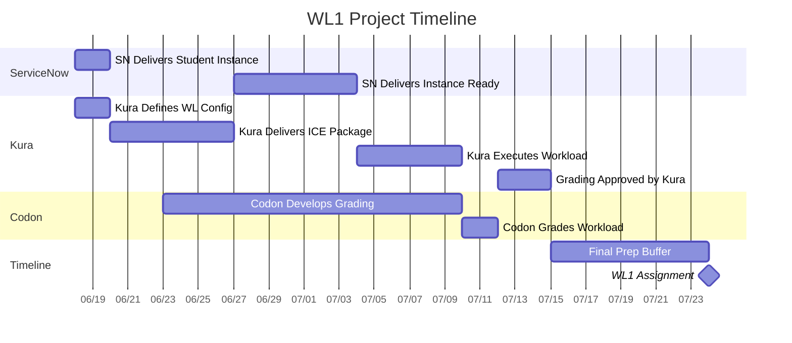

# WL1 Project Schedule - Codon Complete by July 15th

## Project Timeline

## Status Update

**In Progress:**
- 🔄 Kura Delivers ICE Package (June 20-27)

**Upcoming:**
- ⏳ All remaining tasks per schedule above
