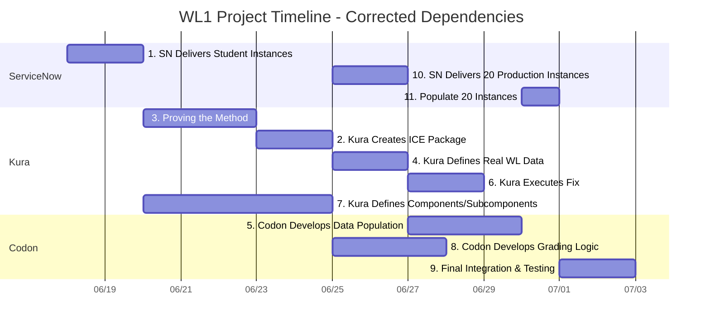

# WL1 Project Schedule - Corrected Flow

## Project Timeline

## Project Schedule Table

| Task | Owner Org | Owner | Start Date | End Date | Duration | Status | Dependencies |
|------|-----------|-------|------------|----------|----------|--------|--------------|
| 1. SN Delivers Student Instances | ServiceNow | [Name] | Wed Jun 18 | Fri Jun 20 | 3 days | ✅ Complete | None |
| 3. Proving the Method | Kura | Luis | Mon Jun 23 | Wed Jun 25 | 3 days | ⏳ Pending | Task 1 |
| 2. Kura Creates ICE Package | Kura | [Name] | Thu Jun 26 | Fri Jun 27 | 2 days | ⏳ Pending | Task 3 |
| 10. SN Delivers 20 Production Instances | ServiceNow | [Name] | Mon Jun 30 | Tue Jul 1 | 2 days | ⏳ Pending | Task 2 |
| 4. Kura Defines Real WL Data | Kura | Luis | Mon Jun 30 | Tue Jul 1 | 2 days | ⏳ Pending | Task 2 |
| 5. Codon Develops Data Population | Codon | [Name] | Wed Jul 2 | Fri Jul 4 | 3 days | ⏳ Pending | Task 4 |
| 6. Kura Executes Fix | Kura | [Name] | Wed Jul 2 | Thu Jul 3 | 2 days | ⏳ Pending | Task 4 |
| 7. Kura Defines Components/Subcomponents | Kura | [Name] | Fri Jun 20 | Thu Jun 26 | 5 days | ⏳ Pending | None |
| 8. Codon Develops Grading Logic | Codon | [Name] | Fri Jun 27 | Tue Jul 1 | 3 days | ⏳ Pending | Task 7 |
| 11. Populate 20 Instances | ServiceNow/Codon | [Name] | Mon Jul 7 | Mon Jul 7 | 1 day | ⏳ Pending | Task 5 |
| 9. Final Integration & Testing | Codon | [Name] | Mon Jul 7 | Mon Jul 7 | 1 day | ⏳ Pending | Tasks 11, 8, 6 |

## Detailed Task Breakdown

### Task 1: SN Delivers Student Instances
| Subtask | Description | Owner Org | Owner | Status |
|---------|-------------|-----------|-------|--------|
| 1a | ServiceNow provisions base student instances | ServiceNow | [Name] | ✅ Complete |
| 1b | Basic instance configuration and setup | ServiceNow | [Name] | ✅ Complete |
| 1c | Delivery confirmation to project team | ServiceNow | [Name] | ✅ Complete |

### Task 3: Proving the Method (FIRST - Critical Decision)
| Subtask | Description | Owner Org | Owner | Status |
|---------|-------------|-----------|-------|--------|
| 3a | Luis manually creates faulty flow with test data | Kura | Luis | ⏳ Pending |
| 3b | Document exactly what was created manually | Kura | Luis | ⏳ Pending |
| 3c | Communicate requirements to Codon | Kura | Luis | ⏳ Pending |
| 3d | Codon attempts programmatic replication | Codon | [Name] | ⏳ Pending |
| 3e | Validate method success/failure | Kura | Luis | ⏳ Pending |
| 3f | **GO/NO-GO DECISION** | Kura | [Name] | ⏳ Pending |

### Task 2: Kura Creates ICE Package (Depends on Task 3 outcome)
| Subtask | Description | Owner Org | Owner | Status |
|---------|-------------|-----------|-------|--------|
| 2a | IF GO: Create structure-only ICE Package | Kura | [Name] | ⏳ Pending |
| 2b | IF NO-GO: Create traditional ICE with embedded data | Kura | [Name] | ⏳ Pending |
| 2c | Package validation and testing | Kura | [Name] | ⏳ Pending |
| 2d | Delivery to ServiceNow team | Kura | [Name] | ⏳ Pending |

### Task 10: SN Delivers 20 Production Instances
| Subtask | Description | Owner Org | Owner | Status |
|---------|-------------|-----------|-------|--------|
| 10a | Install ICE Package on 20 instances | ServiceNow | [Name] | ⏳ Pending |
| 10b | Configure instances for workload | ServiceNow | [Name] | ⏳ Pending |
| 10c | Validate instance readiness | ServiceNow | [Name] | ⏳ Pending |

### Task 4: Kura Defines Real WL Data
| Subtask | Description | Owner Org | Owner | Status |
|---------|-------------|-----------|-------|--------|
| 4a | Define actual workload data requirements | Kura | Luis | ⏳ Pending |
| 4b | Create faulty scenario specifications | Kura | Luis | ⏳ Pending |
| 4c | Document data specifications for population | Kura | Luis | ⏳ Pending |

### Task 5: Codon Develops Data Population
| Subtask | Description | Owner Org | Owner | Status |
|---------|-------------|-----------|-------|--------|
| 5a | Build production data population capability | Codon | [Name] | ⏳ Pending |
| 5b | Test with real workload data specifications | Codon | [Name] | ⏳ Pending |
| 5c | Validate capability before production use | Codon | [Name] | ⏳ Pending |

### Task 6: Kura Executes Fix (Parallel with Task 5)
| Subtask | Description | Owner Org | Owner | Status |
|---------|-------------|-----------|-------|--------|
| 6a | Execute workload fix procedures | Kura | [Name] | ⏳ Pending |
| 6b | Document expected outcomes | Kura | [Name] | ⏳ Pending |

### Task 7: Kura Defines Components/Subcomponents (Independent)
| Subtask | Description | Owner Org | Owner | Status |
|---------|-------------|-----------|-------|--------|
| 7a | Define WL1 grading components | Kura | [Name] | ⏳ Pending |
| 7b | Define subcomponents for each component | Kura | [Name] | ⏳ Pending |
| 7c | Deliver specifications to Codon | Kura | [Name] | ⏳ Pending |

### Task 8: Codon Develops Grading Logic (Parallel)
| Subtask | Description | Owner Org | Owner | Status |
|---------|-------------|-----------|-------|--------|
| 8a | Develop grading logic based on components | Codon | [Name] | ⏳ Pending |
| 8b | Build validation for each subcomponent | Codon | [Name] | ⏳ Pending |
| 8c | Test grading logic | Codon | [Name] | ⏳ Pending |

### Task 11: Populate 20 Instances
| Subtask | Description | Owner Org | Owner | Status |
|---------|-------------|-----------|-------|--------|
| 11a | Use approved data population method | Codon | [Name] | ⏳ Pending |
| 11b | Populate all 20 instances with workload data | Codon | [Name] | ⏳ Pending |
| 11c | Validate data consistency across instances | ServiceNow/Codon | [Name] | ⏳ Pending |

### Task 9: Final Integration & Testing
| Subtask | Description | Owner Org | Owner | Status |
|---------|-------------|-----------|-------|--------|
| 9a | End-to-end testing on populated instances | Codon | [Name] | ⏳ Pending |
| 9b | Final validation and sign-off | Kura | [Name] | ⏳ Pending |

## Critical Path & Key Changes

**⚠️ CRITICAL DECISION POINT:**
- Task 3 determines if we proceed with new method or fallback to traditional ICE approach
---
*Last Updated: June 20, 2025*
