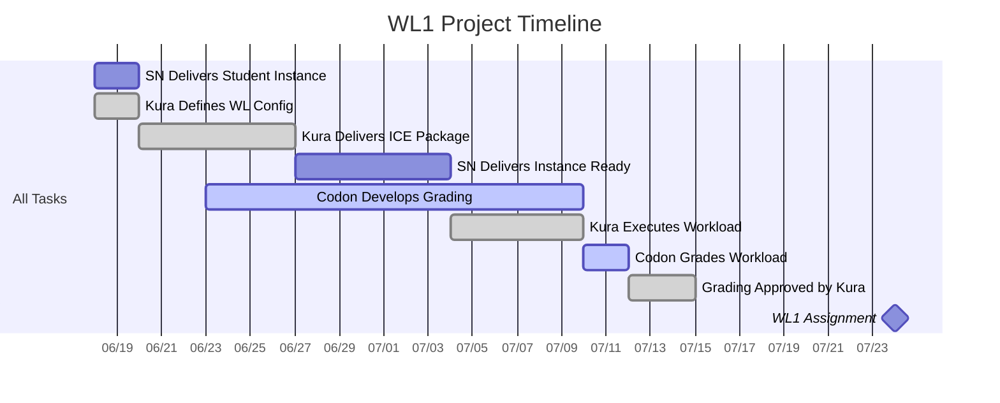

# WL1 Project Schedule - Codon Complete by July 15th

## Project Timeline

```mermaid
gantt
    title WL1 Project Timeline
    dateFormat YYYY-MM-DD
    axisFormat %m/%d
    
    section All Tasks
    SN Delivers Student Instance          :sn1, 2025-06-18, 2025-06-20
    Kura Defines WL Config                :done, k5, 2025-06-18, 2025-06-20
    Kura Delivers ICE Package             :done, k2, after sn1, 7d
    SN Delivers Instance Ready            :sn3, after k2, 7d
    Codon Develops Grading                :active, c6, 2025-06-23, 2025-07-10
    Kura Executes Workload                :done, k4, after sn3, 6d
    Codon Grades Workload                 :active, c7, after k4, 2d
    Grading Approved by Kura              :done, k8, after c7, 3d
    WL1 Assignment                        :milestone, assign, 2025-07-24, 0d
```
