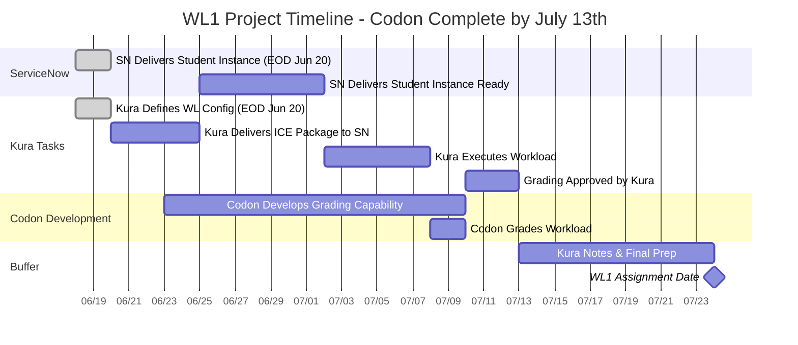

# WL1 Project Schedule - Codon Complete by July 13th

## Gantt Chart

## Project Schedule Table

| Task | Owner | Start Date | End Date | Duration | Status | Dependencies |
|------|-------|------------|----------|----------|--------|--------------|
| 1. SN Delivers Student Instance | ServiceNow | Jun 18 | Jun 20 | 3 days | 🟡 In Progress | None |
| 2. Kura Delivers ICE Package to SN | Kura | Jun 20 | Jun 25 | 5 days | ⏳ Pending | Task 1 |
| 3. SN Delivers Student Instance Ready | ServiceNow | Jun 25 | Jul 2 | 7 days | ⏳ Pending | Task 2 |
| 4. Kura Executes Workload | Kura | Jul 2 | Jul 8 | 6 days | ⏳ Pending | Task 3 |
| 5. Kura Defines WL Config | Kura | Jun 18 | Jun 20 | 3 days | 🟡 In Progress | None |
| 6. Codon Develops Grading Capability | Codon | Jun 23 | Jul 10 | 18 days | ⏳ Pending | Tasks 4, 5 |
| 7. Codon Grades Workload | Codon | Jul 8 | Jul 10 | 2 days | ⏳ Pending | Task 6 |
| 8. Grading Approved by Kura | Kura | Jul 10 | Jul 13 | 3 days | ⏳ Pending | Task 7 |
| **Buffer: Kura Notes & Final Prep** | Kura | Jul 13 | Jul 24 | 11 days | ⏳ Pending | Task 8 |

## Detailed Task Breakdown

### 📋 Task 1: SN Delivers Student Instance (EOD Jun 20)
| Subtask | Description | Owner | Status |
|---------|-------------|-------|--------|
| 1a | ServiceNow provisions base student instance | ServiceNow | 🟡 In Progress |
| 1b | Basic instance configuration and setup | ServiceNow | ⏳ Pending |
| 1c | Delivery confirmation to project team | ServiceNow | ⏳ Pending |

### 📦 Task 2: Kura Delivers ICE Package to SN
| Subtask | Description | Owner | Status |
|---------|-------------|-------|--------|
| 2a | Prepare ICE Package including Update Set/Data | Kura | ⏳ Pending |
| 2b | Package validation and testing | Kura | ⏳ Pending |
| 2c | Delivery to ServiceNow team | Kura | ⏳ Pending |
| 2d | Installation instructions and documentation | Kura | ⏳ Pending |

### 🎯 Task 3: SN Delivers Student Instance Ready for Workload Execution
| Subtask | Description | Owner | Status |
|---------|-------------|-------|--------|
| 3a | Install ICE Package on student instance | ServiceNow | ⏳ Pending |
| 3b | Configure instance for workload execution | ServiceNow | ⏳ Pending |
| 3c | Create Update Set | ServiceNow | ⏳ Pending |
| 3d | Create Workflow with SLA breach, incident row, faulty notification | ServiceNow | ⏳ Pending |
| 3e | Instance validation and testing | ServiceNow | ⏳ Pending |

### ⚡ Task 4: Kura Executes Workload
| Subtask | Description | Owner | Status |
|---------|-------------|-------|--------|
| 4a | Fix notification step in workflow | Kura | ⏳ Pending |
| 4b | New notification in workflow | Kura | ⏳ Pending |
| 4c | New incident in incidents table | Kura | ⏳ Pending |
| 4d | Validate workload completion | Kura | ⏳ Pending |

### 📝 Task 5: Kura Defines WL Config (EOD Jun 20)
| Subtask | Description | Owner | Status |
|---------|-------------|-------|--------|
| 5a | WL Configuration delivered EOD June 20th | Kura | 🟡 In Progress |
| 5b | Define WL1 Components: WIP, Notification, Workflow, Scripting | Kura | 🟡 In Progress |

### 🔧 Task 6: Codon Develops Grading Capability
| Subtask | Description | Owner | Status |
|---------|-------------|-------|--------|
| 6a | Development starts June 23rd | Codon | ⏳ Pending |
| 6b | Develop query logic via Records API | Codon | ⏳ Pending |
| 6c | Build count validation and incident-notification relationship checks | Codon | ⏳ Pending |
| 6d | TBD: Additional grading requirements | Codon | ⏳ Pending |

### 📊 Task 7: Codon Grades Workload
| Subtask | Description | Owner | Status |
|---------|-------------|-------|--------|
| 7a | Execute grading against student instance | Codon | ⏳ Pending |
| 7b | Generate grading results | Codon | ⏳ Pending |
| 7c | Validate grading accuracy | Codon | ⏳ Pending |

### ✅ Task 8: Grading Approved by Kura
| Subtask | Description | Owner | Status |
|---------|-------------|-------|--------|
| 8a | Kura validates grading logic and results | Kura | ⏳ Pending |
| 8b | Final approval for WL1 launch | Kura | ⏳ Pending |
| 8c | Sign-off for production deployment | Kura | ⏳ Pending |

## 🎯 Key Milestones

| Milestone | Date | Status |
|-----------|------|--------|
| Today | June 18, 2025 | ✅ Current |
| WL Config Complete | June 20, 2025 (EOD) | 🟡 In Progress |
| Codon Development Starts | June 23, 2025 | ⏳ Pending |
| Codon Complete | July 13, 2025 | ⏳ Pending |
| **WL1 Assignment** | **July 24, 2025** | ⏳ **TARGET** |

## ⚠️ Critical Dependencies
- **Task 6** (Codon Development) requires both **Task 5** (WL Config) AND **Task 4** (WL Execution)
- **Task 7** (Codon Grading) depends on **Task 6** completion
- **Task 8** (Approval) gates the final launch preparation
- **1.5-week buffer** for final preparations and notes

---
*Last Updated: June 18, 2025*
